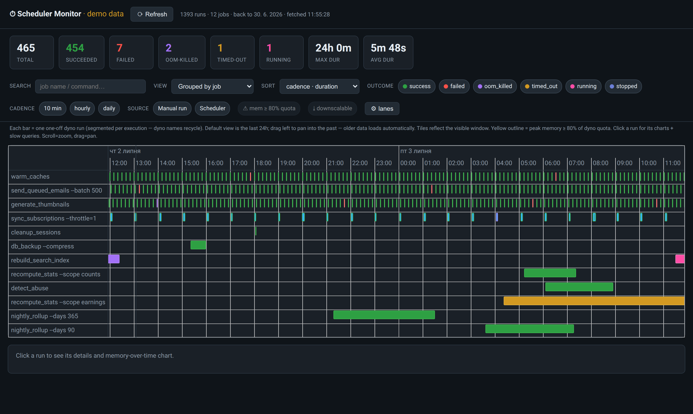
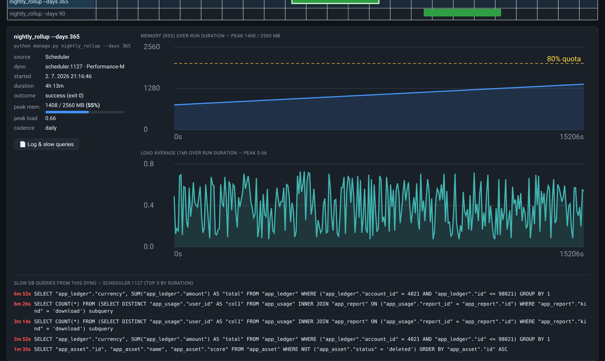
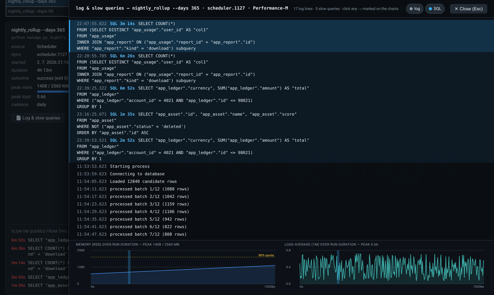
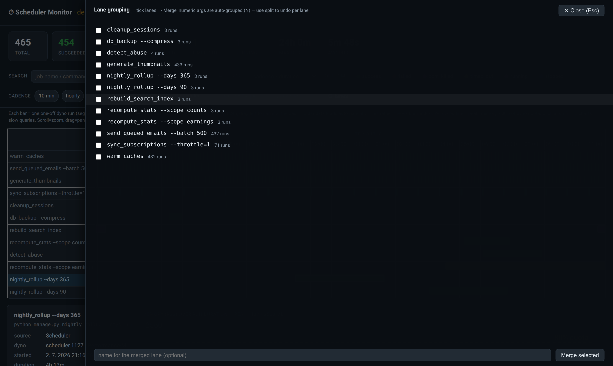

# django-scheduler-monitor

**A monitoring dashboard for Heroku one-off dynos — Heroku Scheduler, Advanced
Scheduler, and `heroku run` — that plugs into your Django admin and needs
nothing but the log drain you already have.**

Heroku's own scheduler UIs show a flat, unstacked event list with almost no
history tooling. This app reconstructs every one-off dyno run from your log
drain (stored in [Axiom](https://axiom.co)) and gives you the dashboard Heroku
never built:



## What you get

- **A real timeline** — one lane per job, correctly stacked, with pan-to-load
  older history, zoom, lane sorting, and filters (outcome, cadence, source,
  free-text search).
- **Honest outcomes** — not just green/red: `success`, `failed`,
  `oom_killed` (exit 137), `timed_out` (killed at Heroku's 24 h one-off wall),
  `stopped` (`heroku ps:stop` / deploy restart — *not* the same as finishing!),
  `crashed`, `running`. Runs whose terminal log line was dropped are closed
  from their telemetry instead of showing as running forever.
- **Per-run memory & load charts** — RSS over the run's duration with an
  80 %-of-quota marker, plus load average (Heroku publishes no true CPU% for
  one-off dynos; load is the honest proxy).

  

- **Right-sizing hints** — jobs running hot (peak ≥ 80 % of dyno RAM) get a
  warning outline; jobs whose whole run fits under 80 % of a *smaller* dyno
  tier are flagged **downscalable** with the concrete target
  (`⤓ fits Standard-1X (512 MB)`), with filters for both.
- **Job output + slow SQL in one stream** — click a run and open its full
  stdout/stderr *interleaved chronologically with the Postgres slow-query log*,
  each entry timestamped. Click any line and its moment (or the query's
  duration band) is marked on the charts below. Slow queries are attributed to
  the exact dyno via `application_name` — no time-overlap guessing.

  

- **Lane grouping that matches how you think** — numeric arguments are
  normalized automatically (`--days 365` and `--days 90` share a lane;
  `--operations counts` vs `--operations earnings` stay separate), cadence is
  inferred per group, and a merge/split dialog stores manual overrides in the
  database.

  

*All screenshots show generated demo data.*

## How it works

Heroku already logs everything this needs: one-off dyno lifecycle lines
(`Starting process with command …`, `State changed …`, `Process exited with
status N`), `sample#memory_rss`/`load_avg` metrics, and the Postgres
slow-query log. If your app's log drain flows into an Axiom dataset, this app
reconstructs runs from those lines at view time — **no agent, no polling
worker, no schema for run data**. The only database table stores your manual
lane merges.

```
Heroku dynos ──logplex──► log drain ──► Axiom dataset
                                            ▲
                    django-scheduler-monitor ┘  (APL queries, staff-only views)
```

## Requirements

- Django ≥ 4.2, Python ≥ 3.10
- A Heroku app whose logs are drained to an [Axiom](https://axiom.co) dataset
  (`heroku drains:add <axiom endpoint>`); the free Axiom tier is plenty for
  most apps
- An Axiom **API token** with read access to that dataset
- *Optional, for slow-SQL attribution:* set each connection's Postgres
  `application_name` to the dyno id — one settings block:

  ```python
  # settings.py — lets slow-query log lines join to the exact dyno/run
  _dyno = os.environ.get("DYNO")
  for _db in DATABASES.values():
      _db.setdefault("OPTIONS", {})["application_name"] = (_dyno or "app")[:63]
  ```

## Installation

```bash
pip install django-scheduler-monitor   # or add the git URL to your deps
```

```python
# settings.py
INSTALLED_APPS = [
    # …
    "scheduler_monitor",
]

SCHEDULER_MONITOR = {
    "AXIOM_DATASET": "my_production_logs",
    # token read from the AXIOM_TOKEN env var by default
}
```

```python
# urls.py — mount it somewhere staff-only-ish; the views themselves
# are staff_member_required
path("admin/scheduler/", include("scheduler_monitor.urls")),
```

```bash
python manage.py migrate scheduler_monitor
```

Open `/admin/scheduler/` as a staff user. Done.

### Optional: persistent history

By default everything is queried live from Axiom, so history is bounded by
your drain's retention (often just days). To keep runs forever, schedule

```bash
python manage.py sync_scheduler_runs      # idempotent upsert, every 10-30 min
```

(e.g. on Heroku Scheduler itself). Persisted periods are then served from the
database — panning into old history becomes instant and works beyond the
drain's retention, and runs are browsable in the Django admin. Deliberately
**runs only**: job output and slow queries are not stored and stay on-demand
from the drain (so they age out with its retention).

> **Security note:** the Axiom token grants read access to *all* logs in the
> dataset (which typically include emails, IPs, SQL). It is only ever used
> server-side, and every view is staff-gated — keep it that way. All responses
> are sent `Cache-Control: no-store` so no browser or CDN caches the log data;
> set `REQUIRE_VERIFIED: True` to additionally demand a 2FA-verified session.

## Try it in 60 seconds (no Heroku, no Axiom)

The bundled example project runs the dashboard on generated demo data:

```bash
git clone https://github.com/PetrDlouhy/django-scheduler-monitor
cd django-scheduler-monitor/example
pip install Django
python manage.py migrate
python manage.py runserver
# open http://localhost:8000/  (auto-login as a demo staff user)
```

## Configuration reference

| key | default | meaning |
|---|---|---|
| `AXIOM_DATASET` | — (required) | Axiom dataset receiving the Heroku drain |
| `AXIOM_TOKEN` | `env AXIOM_TOKEN` | Axiom API token (read) |
| `AXIOM_URL` | Axiom cloud APL endpoint | override for self-hosted Axiom |
| `ONEOFF_PREFIXES` | `["scheduler.", "advanced-scheduler.", "run."]` | dyno name prefixes treated as one-off runs |
| `JOB_LABEL_RULES` | `[]` | `(regex, label)` pairs naming non-`manage.py` commands, e.g. `[(r"renew_cache", "curl: cache warm")]` |
| `DEFAULT_LOOKBACK` | `"3d"` | history fetched on page load |
| `SERIES_LOOKBACK` | `"36h"` | window for memory/load samples and slow SQL (heavier queries) |
| `OLDER_CHUNK_DAYS` | `3` | how much more history each pan-left loads |
| `CACHE_SECONDS` | `60` | Django-cache TTL for the dataset (Refresh bypasses it) |
| `REQUIRE_VERIFIED` | `False` | also require a verified 2FA session (django-otp `is_verified()`) on top of staff status |
| `DEMO` | `False` | serve generated demo data instead of querying Axiom |

## Notable honesty details

Things this dashboard gets right that are easy to get wrong (each learned the
hard way against a real production app):

- **Dyno names recycle.** `scheduler.1234` is not a run id — runs are
  segmented per execution and samples/queries are attributed by time interval.
- **Terminal log lines get dropped.** A run isn't "running" just because no
  exit line arrived; fresh telemetry is the liveness signal, and 24-hour runs
  without a clean exit are classified as killed at Heroku's one-off wall.
- **`ps:stop` looks like success.** Heroku logs `up to complete` + exit 0 for
  a manually stopped job; the `Stopping all processes with SIGTERM` marker
  (without a `Cycling` line) reveals it didn't finish on its own.
- **`heroku run` dynos don't log their command** — it's announced by the `api`
  control plane and matched back to the dyno.
- **Long SQL statements are split** across ~1 KB drain lines; they are
  reassembled before display, so you see the `WHERE`, not just the column list.
- **Attached `heroku run` sessions stream output to your terminal, not the
  drain** — use `heroku run:detached` if you want their output captured.

## Status & roadmap

Alpha — extracted from an internal tool monitoring a production Heroku app.
Interfaces may still move. Planned:

- pluggable log backends (direct HTTPS drain ingestion, other log stores)
- live `heroku ps` cross-check via the Platform API (optional)
- schedule-definition diffing (expected vs. actual runs)

Issues and PRs welcome.

## License

MIT
